# RPSLS

RPSLS is a site that lets users play a fun, interactive game of rock, paper, scissors, lizard, spock agains the computer. The site's primary users are those looking to enjoy a quick game at the click of a button. RPSLS includes the result of the game, a running scoreboard and images based on what the user has selected and the computer's move.

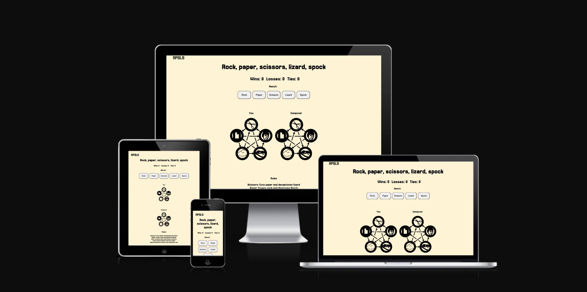

## Features 

The RPSLS website includes the following features:

- Buttons for the user to select their move
- An image generator that shows the user's move and the computer's move visually
- A result display
- A running scoreboard showing number of wins, losses and ties

### Existing Features

__Buttons__

  - The buttons show the user the different moves they can select in order to play against the computer.
  - This allows the user to play the game by selecting one of the buttons. This also randomly selects the computer's move and generates the images to showcase the user's and computer's moves visually.

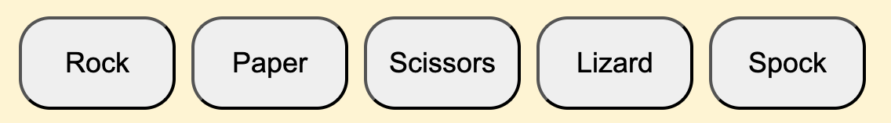

__Images__

  - The images show the user's move and the computer's move 
  - This helps the user to quickly see what they have selected and what the computer has selected. From here, they can also work out who's won.

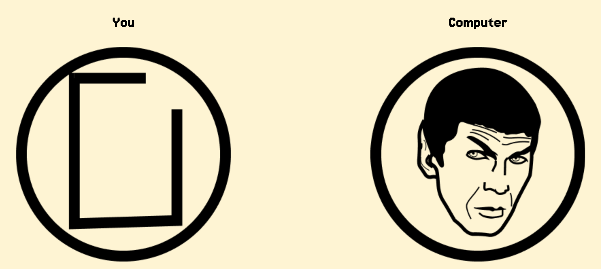

__Result__

  - The result section shows the outcome of each game.
  - Depending on the outcome of the game, the result section will show:
    - It's a tie!
    - You win!
    - You lose!
  This helps the user to quickly see who has won or if it's a draw.
   
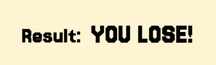

__Scoreboard__

  - The scoreboard shows how many wins, losses and ties the user has had.
  - Each time the game is played, the scoreboard is automatically updated with the result of the game. This is a running scoreboard that will keep track of all wins, losses and ties during each session. 

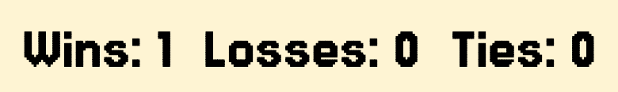

__Rules__ 

  - The rules section shows the winning scenarios for each move.
  - This helps the user to quickly understand how to play the game and how the winner is determined.

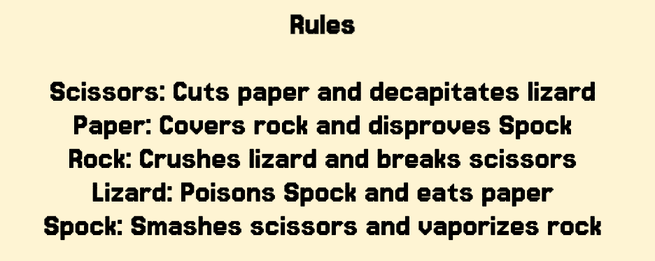

__Footer__ 

  - The footer repeats the different options you can choose.
  - It does not provide any functionality other than reminding the user of the different options available when playing the game.

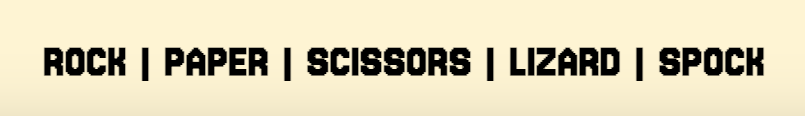

__Favicon__

  - A favicon will be implemented with the rock, paper, scissors, lizard, spock initials 'RPSLS'.
  - This will show an image in the tab so users can identify the RPSLS website when they have multiple tabs open.

  

__404 page__

  - If a user navigates to a broken link, a 404 page will be displayed.
  - It will let users know that the page they're trying to navigate to doesn't exist and provide them an easy way to return to the home page.

  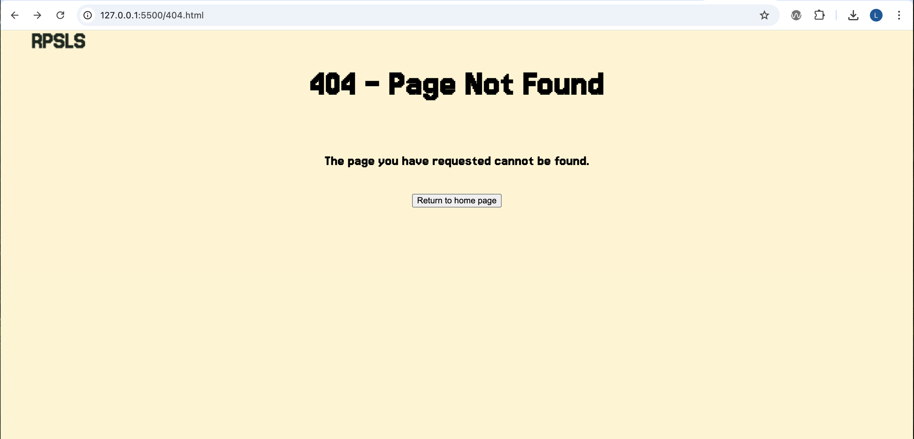
 

### Features to implement in the future

- A button that lets the user pick a move at random
- A 2-player version of the game

## Design

### Wireframes

Home page on desktop

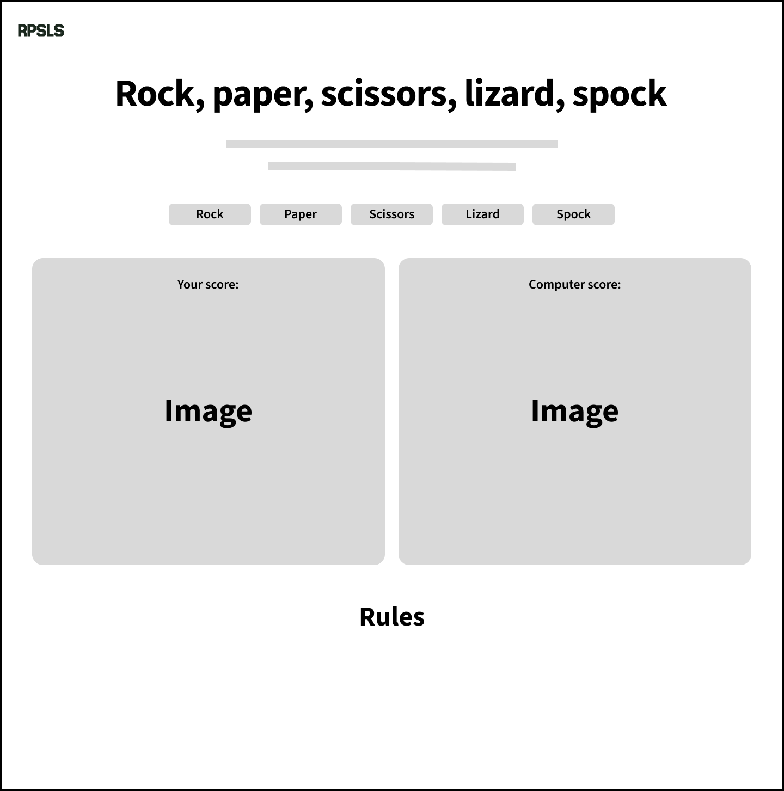

Home page on mobile

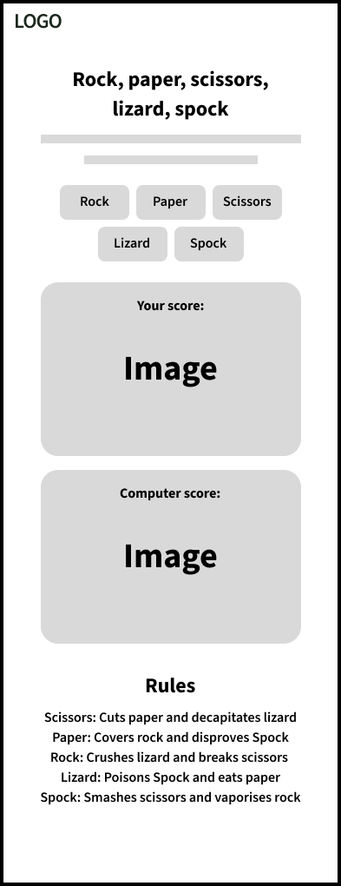

Home page on tablet

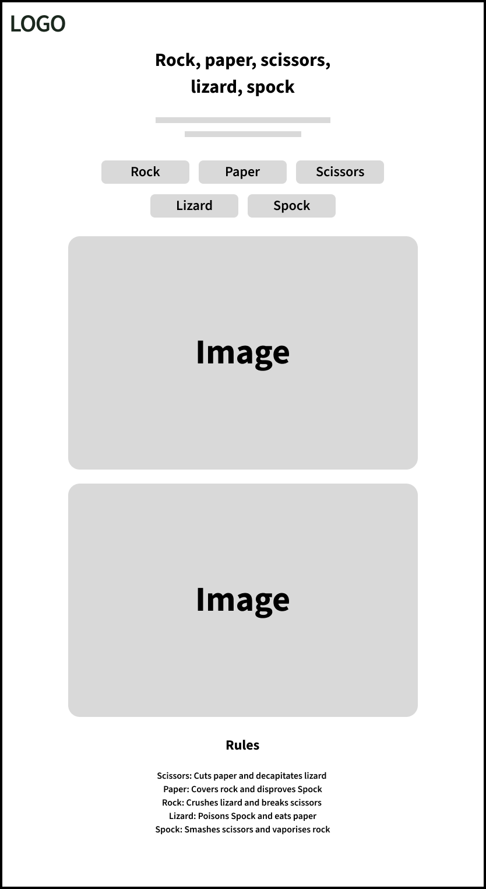

## Technologies

* HTML
    * The structure of the Website was developed using HTML as the main language.
* CSS
    * The Website was styled using custom CSS in an external file.
* JavaScript
    * The interactivity was created using JavaScript in an external file.
* Visual Studio Code
    * The website was developed using the Visual Studio Code text editor.
* GitHub
    * Source code is hosted on GitHub and delpoyed using Git Pages.
* Git 
    * Used to commit and push code during the development opf the Website
* Font Awesome
    * Icons obtained from https://fontawesome.com/ were used as the Social media links in the footer section. 
* Favicon.io
    * favicon files were created at https://favicon.io/favicon-converter/
* Figma
    * Used to design the wireframes and the UI for the ZenYoga website

## Testing

### Responsiveness

All pages were tested to ensure responsiveness on screen sizes from 320px and upwards as defined in [WCAG 2.2 Reflow criteria for responsive design](https://www.w3.org/WAI/WCAG22/Understanding/reflow.html) on Chrome and safari browsers.

Steps to test:

1. Open browser and navigate to [RPSLS](/https://luke-nicklin.github.io/rpsls/)
2. Open the developer tools (right click and inspect)
3. Set to responsive and decrease width to 320px
4. Set the zoom to 50%
5. Click and drag the responsive window to maximum width

Expected:

Website is responsive on all screen sizes and no images are pixelated or stretched.

Actual:

Website behaved as expected.

### Accessibility

[Wave Accessibility](https://wave.webaim.org/) tool was used for final testing of the deployed website to check for any accessibility issues.

Testing checked to see if the following criteria were met:

- Color contrasts meet a minimum ratio as specified in [WCAG 2.2 Contrast Guidelines](https://www.w3.org/WAI/WCAG22/Understanding/contrast-minimum.html)
- Heading levels are not missed or skipped to ensure the importance of content is relayed correctly to the end user
- All content is contained within landmarks to ensure ease of use for assistive technology, allowing the user to navigate by page regions
- All non textual content had alternative text or titles so descriptions are read out to screen readers
- HTML page lang attribute has been set
- Aria properties have been implemented correctly
- WCAG 2.2 Coding best practices being followed

### Lighthouse Testing

__Home__

__404 page__

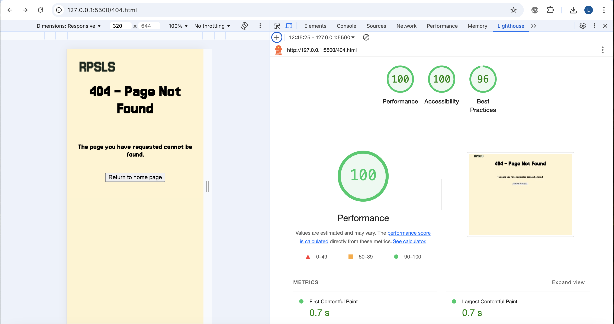

### Functional Testing

**Buttons**

Testing was performed to ensure all buttons on the respective pages resulted in the expected behavious to the correc as per design. This was done by selecting the buttons on each page.

| Navigation Link | Page to Load     |
| --------------- | ---------------  |
| Home            | index.html       |
| 404             | 404.html         |

Buttons on all pages produced the expected behaviour as exptected.

### Validator Testing 

- HTML
  - No errors were returned when passing the home page through the official [W3C validator](https://validator.w3.org/nu/?doc=https%3A%2F%2Fluke-nicklin.github.io%2Frpsls%2F)
  - No errors were returned when passing the 404 page through the official [W3C validator](https://validator.w3.org/nu/?doc=https%3A%2F%2Fluke-nicklin.github.io%2Frpsls%2F404)

- CSS
  - No errors were found when passing the home page through the official [W3C validator](https://jigsaw.w3.org/css-validator/validator?uri=https%3A%2F%2Fluke-nicklin.github.io%2Frpsls%2F&profile=css3svg&usermedium=all&warning=1&vextwarning=&lang=en)
  - No errors were returned when passing the 404 page through the official [W3C Validator](https://jigsaw.w3.org/css-validator/validator?uri=https%3A%2F%2Fluke-nicklin.github.io%2Frpsls%2F404&profile=css3svg&usermedium=all&warning=1&vextwarning=&lang=en)

### Bugs

There are currently no known bugs associated with the website.

## Deployment

- The site was deployed to GitHub pages. The steps to deploy are as follows: 
  - In the GitHub repository, navigate to the Settings tab 
  - Select Pages in the 'Code and automation' section of the vertical navigation on the left side
  - Once the main branch has been selected and saved, the page will include the live URL at the top of the page with a visit site button.

The live link can be found here - https://luke-nicklin.github.io/zen-yoga/

## Credits 

### Code

- The site uses components and patterns from Bootstrap.

### Content 

- The text for the Meditation page was taken from a Google search result AI overview. The AI overview delivered a summary of meditation techniques from the following sources:
  - NHS
  - MedicalNewsToday
  - Verywell mind
  - Mayo Clinic
  - YouTube
  - Gaiam
  - Insight Timer
  - tonyrobbins.com

- The text for the Yoga page was taken from a Google search result AI overview. The AI overview delivered a summary of yoga techniques from the following sources:
  - Verywell Fit
  - Brio Leisure
  - WorkouLabs

- The text for the Mindfulness page was taken from a Google search result AI overview. The AI overview delivered a summary of mindfulness techniques from the following sources:
  - Mayo Clinic
  - Mindful.org
  - NHS
  - NHS news in health
  - YouTube
  
- The icons in the footer were taken from [Font Awesome](https://fontawesome.com/)

### Media

- The photos used on the website are from pexels.com