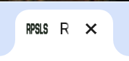
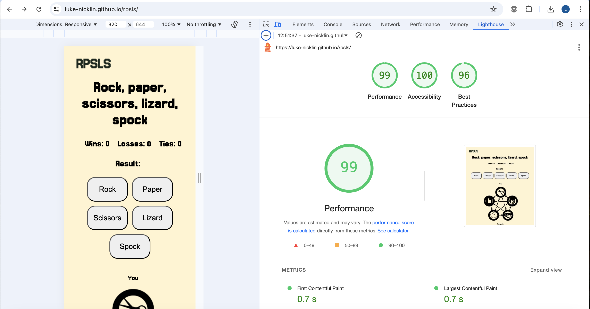

# RPSLS

RPSLS is a site that lets users play a fun, interactive game of rock, paper, scissors, lizard, spock agains the computer. The site's primary users are those looking to enjoy a quick game at the click of a button. RPSLS includes the result of the game, a running scoreboard and images based on what the user has selected and the computer's move.


## Features 

The RPSLS website includes the following features:

- Buttons for the user to select their move
- An image generator that shows the user's move and the computer's move visually
- A result display
- A running scoreboard showing number of wins, losses and ties

### Existing Features

__Buttons__

  - The buttons show the user the different moves they can select in order to play against the computer.
  - This allows the user to play the game by selecting one of the buttons. This also randomly selects the computer's move and generates the images to showcase the user's and computer's moves visually.


__Images__

  - The images show the user's move and the computer's move 
  - This helps the user to quickly see what they have selected and what the computer has selected. From here, they can also work out who's won.


__Result__

  - The result section shows the outcome of each game.
  - Depending on the outcome of the game, the result section will show:
    - It's a tie!
    - You win!
    - You lose!
  This helps the user to quickly see who has won or if it's a draw.
   


__Scoreboard__

  - The scoreboard shows how many wins, losses and ties the user has had.
  - Each time the game is played, the scoreboard is automatically updated with the result of the game. This is a running scoreboard that will keep track of all wins, losses and ties during each session. 


__Rules__ 

  - The rules section shows the winning scenarios for each move.
  - This helps the user to quickly understand how to play the game and how the winner is determined.


__Footer__ 

  - The footer repeats the different options you can choose.
  - It does not provide any functionality other than reminding the user of the different options available when playing the game.


__Favicon__

  - A favicon will be implemented with the rock, paper, scissors, lizard, spock initials 'RPSLS'.
  - This will show an image in the tab so users can identify the RPSLS website when they have multiple tabs open.

  

__404 page__

  - If a user navigates to a broken link, a 404 page will be displayed.
  - It will let users know that the page they're trying to navigate to doesn't exist and provide them an easy way to return to the home page.

  
 

### Features to implement in the future

- A button that lets the user pick a move at random
- A 2-player version of the game

## Design

### Wireframes

Home page on desktop


Home page on mobile


Home page on tablet


## Technologies

* HTML
    * The structure of the Website was developed using HTML as the main language.
* CSS
    * The Website was styled using custom CSS in an external file.
* JavaScript
    * The interactivity was created using JavaScript in an external file.
    * Used to listen for user clicks on the buttons.
    * Used to generate the image for the user's move when the user selects a button.
    * Used to generate the image for the computer's move when the user selects a button.
    * Used to display the result of each game.
    * Used to update the scoreboard to show the number of wins, losses and ties. 
* Visual Studio Code
    * The website was developed using the Visual Studio Code text editor.
* GitHub
    * Source code is hosted on GitHub and delpoyed using Git Pages.
* Git 
    * Used to commit and push code during the development opf the Website 
* Favicon.io
    * favicon files were created at https://favicon.io/favicon-converter/
* Figma
    * Used to design the wireframes and the UI for the ZenYoga website

## Testing

### Responsiveness

All pages were tested to ensure responsiveness on screen sizes from 320px and upwards as defined in [WCAG 2.2 Reflow criteria for responsive design](https://www.w3.org/WAI/WCAG22/Understanding/reflow.html) on Chrome and safari browsers.

Steps to test:

1. Open browser and navigate to [RPSLS](/https://luke-nicklin.github.io/rpsls/)
2. Open the developer tools (right click and inspect)
3. Set to responsive and decrease width to 320px
4. Set the zoom to 50%
5. Click and drag the responsive window to maximum width

Expected:

Website is responsive on all screen sizes and no images are pixelated or stretched.

Actual:

Website behaved as expected.

### Accessibility

[Wave Accessibility](https://wave.webaim.org/) tool was used for final testing of the deployed website to check for any accessibility issues.

Testing checked to see if the following criteria were met:

- Color contrasts meet a minimum ratio as specified in [WCAG 2.2 Contrast Guidelines](https://www.w3.org/WAI/WCAG22/Understanding/contrast-minimum.html)
- Heading levels are not missed or skipped to ensure the importance of content is relayed correctly to the end user
- All content is contained within landmarks to ensure ease of use for assistive technology, allowing the user to navigate by page regions
- All non textual content had alternative text or titles so descriptions are read out to screen readers
- HTML page lang attribute has been set
- Aria properties have been implemented correctly
- WCAG 2.2 Coding best practices being followed

### Lighthouse Testing

__Home__



__404 page__


### Functional Testing

**Buttons**

Testing was performed to ensure all buttons resulted in the expected behaviour as per design. This was done by selecting each button on the home page and 404 page.

| Navigation Link | Page to Load     |
| --------------- | ---------------  |
| Home            | index.html       |
| 404             | 404.html         |

Buttons on all pages produced the expected behaviour.

Steps to test

1. Navigate to [RPSLS] (https://luke-nicklin.github.io/rpsls/)
2. Select "Rock" button
3. Select "Paper" button
2. Select "Scissors" button
3. Select "Lizard" button
2. Select "Spock" button

Expected behaviour

When the user selects a button the matching image will appear under the 'You' H2 and the computer's random move will generate the image that matches its move under the 'Computer' H2.

Actual:

Behaviour as expected

**Result**

Steps to test

1. Navigate to [RPSLS] (https://luke-nicklin.github.io/rpsls/)
2. Select "Rock" button
3. Select "Paper" button
2. Select "Scissors" button
3. Select "Lizard" button
2. Select "Spock" button

Expected behaviour

When the user selects a button, the result displays the outcome of each game. It will either say 'You win!', 'You lose!' or 'It's a tie!'

Actual:

Behaviour as expected

**Scoreboard**

Steps to test

1. Navigate to [RPSLS] (https://luke-nicklin.github.io/rpsls/)
2. Select "Rock" button
3. Select "Paper" button
2. Select "Scissors" button
3. Select "Lizard" button
2. Select "Spock" button

When the user selects a button, the scoreboard is updated with the result of each game. This is a running total of the results of all the games in the session.

Actual:

Behaviour as expected.

### Validator Testing 

- HTML
  - No errors were returned when passing the home page through the official [W3C validator](https://validator.w3.org/nu/?doc=https%3A%2F%2Fluke-nicklin.github.io%2Frpsls%2F)
  - No errors were returned when passing the 404 page through the official [W3C validator](https://validator.w3.org/nu/?doc=https%3A%2F%2Fluke-nicklin.github.io%2Frpsls%2F404)

- CSS
  - No errors were found when passing the home page through the official [W3C validator](https://jigsaw.w3.org/css-validator/validator?uri=https%3A%2F%2Fluke-nicklin.github.io%2Frpsls%2F&profile=css3svg&usermedium=all&warning=1&vextwarning=&lang=en)
  - No errors were returned when passing the 404 page through the official [W3C Validator](https://jigsaw.w3.org/css-validator/validator?uri=https%3A%2F%2Fluke-nicklin.github.io%2Frpsls%2F404&profile=css3svg&usermedium=all&warning=1&vextwarning=&lang=en)

- JavaScript
  - No errors were found when passing the home page through the JSHint checker website  

### Bugs

- Scoreboard

I encountered a bug with the scoreboard where it would reset for each game. Therefore, it did not keep a running track of the scores. I managed to fix this by moving the event listeneres and attaching them to the DOM variables. However this lead to an issue with the playGame function running twice every time a button was clicked.

I realised that I had an onclick="playGame('rock')" on each button within my HTML that was causing this issue. By removing this, the playGame function only ran once and the scoreboard went up in increments of one each time a game was played.

## Deployment

- The site was deployed to GitHub pages. The steps to deploy are as follows: 
  - In the GitHub repository, navigate to the Settings tab 
  - Select Pages in the 'Code and automation' section of the vertical navigation on the left side
  - Once the main branch has been selected and saved, the page will include the live URL at the top of the page with a visit site button.

The live link can be found here - https://luke-nicklin.github.io/rpsls/

### Version Control

The site was created using the Visual Studio Code editor and pushed to github to the remote repository 'rpsls'.

The following git commands were used throughout development to push code to the remote repo:

```git add <file>``` - This command was used to add the file(s) to the staging area before they are committed.

```git commit -m "commit message"``` - This command was used to commit changes to the local repository queue ready for the final step.

```git push``` - This command was used to push all committed code to the remote repository on github.

### Clone the Repository Code Locally

Navigate to the GitHub Repository you want to clone to use locally:

- Click on the code drop down button
- Click on HTTPS
- Copy the repository link to the clipboard
- Open your IDE of choice (git must be installed for the next steps)
- Type git clone copied-git-url into the IDE terminal

The project will now have been cloned on your local machine for use.


## Credits 

### Code

- CodeInstitute - JavaScript module helped me to implement certain aspects of the code such as the moves array, playGame function and else/if statements. It also showed me how to change the images when a button is selected using template literals in the example project video.
- StackOverflow - Helped me to troubleshoot issues I was having with JavaScrip throughout the project.
- SheCodes - Helped me work out how to use event listeners for the buttons.
- [Code with Ania Kubów](https://www.youtube.com/watch?v=RwFeg0cEZvQ) was used to help me better understand different ways to use JavaScript to make the game work.


### Media

- The images are from Wikimedia Commons - https://commons.wikimedia.org/wiki/File:Rock_paper_scissors_lizard_spock.svg